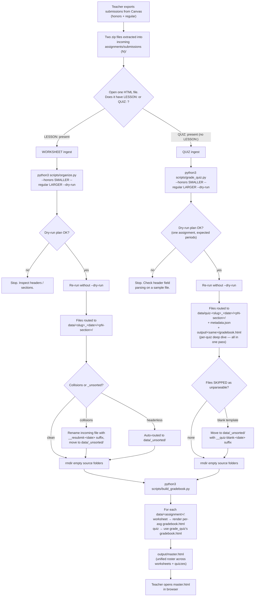

# MadewellGradeBook — Handoff

**Purpose.** This folder turns Canvas submission downloads into a unified HTML gradebook for Madewell's 7th-grade Life Science classes (1 honors section P1, 5 regular sections P2–P6).

**Read this file first.** It is the single source of truth for any new Claude Code session picking up this work.

**One unified master gradebook.** All assignments — worksheets and quizzes — appear in `output/master.html` as columns in the roster. Each assignment also has its own per-assignment `gradebook.html` for deep inspection. Different *ingestion* paths feed the same master view:

- **Worksheets** — daily classwork with a `LESSON:` header. Pipeline: `organize.py` → `build_gradebook.py`. `organize.py` keeps one folder per lesson regardless of submission date (late submissions auto-route into the on-time folder) and auto-extracts question prompts into `metadata.json`. The **answer key for each assignment lives in that assignment's `metadata.json`** — the teacher must fill in `answer_key: {"Q1": "A", …}` before MC grading works. Without one, `gradebook.html` shows a "no answer key" banner instead of misleading colored stats.
- **Quizzes** — assessments with a `QUIZ:` header (no `LESSON:`). Already self-scored by the student-facing app (`SCORE : X / 31 · 100% · A` is baked in — no answer key needed). Pipeline: `grade_quiz.py` → `build_gradebook.py`. `grade_quiz.py` also auto-routes late quiz makeups into the on-time folder (mirrors `organize.py`).

The final step is the same for both: `build_gradebook.py` discovers all `data/<assignment>/` folders (including `quiz-*`) and regenerates `output/master.html` with everything rolled up.

---

## Process flow



---

## Folder layout

```
MadewellGradeBook/
├── HANDOFF.md                    ← this file
├── incoming assignments/         ← staging dir for fresh Canvas downloads (kept empty between runs)
├── data/                         ← organized truth
│   ├── _unsorted/                ← files that couldn't be routed automatically
│   ├── day1-periodic-table_2026-05-04/             ← worksheet folder
│   │   ├── metadata.json
│   │   └── p1-honors/ … p6-regular/
│   ├── …
│   └── quiz-periodic-table-review-days-1-3_2026-05-08/    ← quiz folder (quiz- prefix)
│       ├── metadata.json         (written by grade_quiz.py)
│       └── p1-honors/ … p6-regular/
├── output/                       ← generated HTML
│   ├── master.html               ← unified rollup (worksheets + quizzes, one row per student)
│   ├── <worksheet-assignment>/gradebook.html      ← Stratosyn-styled deep dive
│   └── <quiz-assignment>/gradebook.html           ← quiz deep dive (sortable table + per-question detail)
├── scripts/
│   ├── organize.py               ← worksheet ingest: raw → data/
│   ├── build_gradebook.py        ← reads ALL of data/ → writes per-asg HTML + master.html
│   ├── grade_quiz.py             ← quiz ingest: raw → data/ + per-quiz gradebook.html (single pass)
│   └── _parse.py                 ← shared worksheet header/slug helpers + ANSWER_KEY
├── archive/                      ← old runs (manual)
└── submissions (1).zip           ← legacy artifact, ignore
```

---

## Naming conventions

| Thing                          | Pattern                                                  | Example                                          |
|--------------------------------|----------------------------------------------------------|--------------------------------------------------|
| Worksheet assignment folder    | `<lesson-slug>_<YYYY-MM-DD>/`                            | `day3-chemical-bonding_2026-05-07/`              |
| Quiz assignment folder         | `quiz-<title-slug>_<YYYY-MM-DD>/`                        | `quiz-periodic-table-review-days-1-3_2026-05-08/`|
| Period folder                  | `p<N>-<section>/`                                        | `p1-honors/`, `p4-regular/`                      |
| Student file (Canvas default)  | `<lastnamefirstname>_<canvasID>_text.html`               | `wongkathy_40404_text.html`                      |
| Resubmission (worksheet)       | `<stem>__resubmit-<YYYY-MM-DD>.html`                     | `frankdoellehallie_40768_text__resubmit-2026-05-10.html` |
| Blank-template quiz submission | `<stem>__quiz-blank-<YYYY-MM-DD>.html`                   | `tuckaaron_40423_text__quiz-blank-2026-05-08.html` |

Worksheet slugs come from the `LESSON:` header inside each file (parsed by `_parse.py`).
Quiz slugs come from the `QUIZ:` header value, prefixed with `quiz-`. Both use the embedded `DATE:` field.

---

## Section convention (load-bearing for both pipelines)

When two Canvas-export folders land in `incoming assignments/`:

- **Smaller folder = honors** (P1 only, single section, ~20–30 students)
- **Larger folder = regular** (P2–P6, ~80–110 students, roughly 4× the file count)

Filename suffixes like `(1)` / `(5)` come from browser duplicate-naming and mean nothing. Always identify by file count.

Stored in Claude's auto-memory as `project_madewell_canvas_batches.md`.

---

## Commands

Run from the `MadewellGradeBook/` folder.

### Worksheet flow

```bash
# 1. Preview routing
python3 scripts/organize.py \
  --honors  "incoming assignments/<smaller-folder>" \
  --regular "incoming assignments/<larger-folder>" \
  --dry-run

# 2. Commit
python3 scripts/organize.py \
  --honors  "incoming assignments/<smaller-folder>" \
  --regular "incoming assignments/<larger-folder>"

# 3. Cleanup empty source folders
rmdir "incoming assignments/<smaller-folder>" "incoming assignments/<larger-folder>"

# 4. Rebuild all per-asg gradebooks AND master.html
python3 scripts/build_gradebook.py
```

### Quiz flow

```bash
# 1. Preview routing
python3 scripts/grade_quiz.py \
  --honors  "incoming assignments/<smaller-folder>" \
  --regular "incoming assignments/<larger-folder>" \
  --dry-run

# 2. Commit (writes data/ AND output/<quiz>/gradebook.html in one pass)
python3 scripts/grade_quiz.py \
  --honors  "incoming assignments/<smaller-folder>" \
  --regular "incoming assignments/<larger-folder>"

# 3. If any files were SKIPPED (no parseable header), move them manually:
mv "incoming assignments/<larger-folder>/<filename>" \
   "data/_unsorted/<filename-stem>__quiz-blank-<YYYY-MM-DD>.html"

# 4. Cleanup empty source folders
rmdir "incoming assignments/<smaller-folder>" "incoming assignments/<larger-folder>"

# 5. Refresh master.html to pick up the new quiz
python3 scripts/build_gradebook.py
```

`build_gradebook.py` is the unified rollup step — always run it after either pipeline so `master.html` reflects the new data.

### Adding an answer key for a new worksheet

When `organize.py` ingests a new worksheet, it auto-extracts the question prompts into `metadata.json` but leaves `answer_key: null` for the teacher to fill in. The per-assignment `gradebook.html` will show a "NO ANSWER KEY" banner and skip MC grading until you do.

To grade a worksheet's multiple-choice section:

1. Open `data/<assignment>/metadata.json`.
2. Find the `question_prompts` block — it shows each Q1..Qn with the prompt text.
3. Edit the `answer_key` field from `null` to a dict of correct letters:
   ```json
   "answer_key": {
     "Q1": "A", "Q2": "C", "Q3": "B", "Q4": "C",
     "Q5": "C", "Q6": "B", "Q7": "C", "Q8": "D"
   }
   ```
4. Re-run `python3 scripts/build_gradebook.py`. The banner disappears, the QUESTION DIFFICULTY section appears, and master.html updates the composite scores for that assignment.

You don't need to change any code — `_parse.py` and `build_gradebook.py` read the key from each assignment's metadata at build time.

### Merging same-lesson date splits

**As of 2026-05-10, `organize.py` consolidates automatically.** It picks one canonical folder per lesson — the earliest existing `data/<slug>_<date>/` on disk, or the earliest valid date in the incoming batch if none exists yet. Late submissions land in the on-time folder. You'll see a "REROUTED — N late-submission date(s) consolidated" line in the routing output when this kicks in.

The snippet below is only needed for **legacy cleanup** — folders that were split before the fix shipped. Define the merges as `(keep_folder, drop_folder)` pairs and run:

```bash
python3 << 'PY'
import shutil, json
from datetime import datetime
from pathlib import Path

merges = [
    # (keep, drop)
    ('day1-periodic-table_2026-05-04',                   'day1-periodic-table_2026-05-06'),
    # add more pairs here as late submissions arrive
]

data, output = Path('data'), Path('output')
for keep, drop in merges:
    keep_dir, drop_dir = data / keep, data / drop
    # Pre-flight: refuse if any filename collides
    collisions = [(f.name, p.name) for p in drop_dir.iterdir() if p.is_dir()
                  for f in p.glob('*.html') if (keep_dir / p.name / f.name).exists()]
    if collisions:
        print(f'SKIP {drop} — collisions: {collisions}'); continue
    moved = 0
    for pdir in drop_dir.iterdir():
        if not pdir.is_dir(): continue
        (keep_dir / pdir.name).mkdir(parents=True, exist_ok=True)
        for f in pdir.glob('*.html'):
            shutil.move(str(f), str(keep_dir / pdir.name / f.name)); moved += 1
        try: pdir.rmdir()
        except OSError: pass
    # Refresh metadata + delete drop folder + delete orphaned output
    meta_path = keep_dir / 'metadata.json'
    meta = json.loads(meta_path.read_text()) if meta_path.exists() else {}
    period_counts = {p.name: len(list(p.glob('*.html'))) for p in keep_dir.iterdir() if p.is_dir()}
    meta['period_counts'] = {k: v for k, v in period_counts.items() if v}
    meta['total_students'] = sum(period_counts.values())
    meta['merged_from'] = meta.get('merged_from', []) + [drop]
    meta['merged_at'] = datetime.now().isoformat(timespec='seconds')
    meta_path.write_text(json.dumps(meta, indent=2))
    for c in drop_dir.iterdir():
        c.unlink() if c.is_file() else c.rmdir()
    drop_dir.rmdir()
    if (output / drop).exists(): shutil.rmtree(output / drop)
    print(f'merged {drop} -> {keep} ({moved} files)')
PY
python3 scripts/build_gradebook.py
```

Open `output/master.html` after to verify the dropped column is gone and the late students still appear in the kept lesson column.

---

## Edge cases & how to handle them

| Symptom                                                                 | Cause                                                                          | Fix                                                                                                                |
|-------------------------------------------------------------------------|--------------------------------------------------------------------------------|--------------------------------------------------------------------------------------------------------------------|
| `organize.py` reports `no LESSON header in file`                        | Student deleted/edited the worksheet template                                  | File auto-routes to `data/_unsorted/`. Inspect manually or ignore.                                                 |
| `rmdir: Directory not empty` after worksheet `organize.py`              | Filename collision — destination already had a file with that name             | Files left in source. Rename with `__resubmit-<YYYY-MM-DD>.html` and move to `data/_unsorted/`.                    |
| `build_gradebook.py` flags `n=1 (stray)` in a period                    | One student submitted on a different day than the rest of the class            | Usually fine (late work or working ahead).                                                                         |
| `grade_quiz.py` skips a quiz file as "unparseable"                      | Student submitted the blank, unanswered template (no STUDENT/CLASS/etc fields) | Move to `data/_unsorted/` with `__quiz-blank-<YYYY-MM-DD>.html` suffix.                                            |
| `grade_quiz.py` produces 1 assignment per student instead of 1 total    | Regex matched the title line ("PERIODIC TABLE REVIEW QUIZ: <name>") instead of the formal `QUIZ : <title>` header. | Already fixed via line-anchored regex. If it regresses, ensure field-matching is anchored to `^…` with `re.M`.     |
| `grade_quiz.py` per-student detail shows no Part 1 MC entries           | Quiz HTML uses non-breaking-space (`\xa0`) for indenting `Answer:` / `Result:` | Already fixed via `[^\S\n]*` (any whitespace except newline) in the MC pattern.                                    |
| `CLASS : Phase 4` instead of `CLASS : Period 4`                         | Student-facing app supports Phase/Hour/Block as period aliases                 | Already handled in `grade_quiz.py` field parser.                                                                   |
| Quiz appears in master.html with 0% composite                           | `metadata.json` missing or `parse_quiz` returning None for the records         | Re-run `grade_quiz.py` (writes a fresh `metadata.json`) then `build_gradebook.py`.                                 |
| Quiz card in master.html links to a missing gradebook.html              | `grade_quiz.py` wasn't run before `build_gradebook.py`, OR file was renamed     | Re-run `grade_quiz.py` for the quiz, OR check that `output/<quiz-asg>/gradebook.html` exists.                      |
| Both Canvas folders are similar sizes                                   | Honors/regular convention may not apply this round                             | Don't assume — open one file from each and check the CLASS line.                                                   |
| `master.html` shows the same lesson on two dates (e.g. Day 1 with 122 + 1) | Legacy state from before the late-submission fix.                              | Run the one-time merge snippet under "Merging same-lesson date splits" below. New batches auto-consolidate.        |

---

## State snapshot (as of 2026-05-10)

**4 assignments, 160 students in [output/master.html](output/master.html).** Worksheets are cyan cards, quizzes are gold.

| Assignment                                              | Type     | Honors | Regular | MC avg | Comp avg | Notes                                                    |
|---------------------------------------------------------|----------|--------|---------|--------|----------|----------------------------------------------------------|
| day1-periodic-table_2026-05-04                          | wks      | 25     | 98      | 81%    | 88%      | Answer key in place. One stray P7 row.                   |
| day2-electron-shells-element-families_2026-05-06        | wks      | 25     | 93      | —      | —        | **No answer key yet** — gradebook shows banner.          |
| day3-chemical-bonding_2026-05-07                        | wks      | 27     | 82      | —      | —        | **No answer key yet** — gradebook shows banner.          |
| **quiz-periodic-table-review-days-1-3_2026-05-08**      | **quiz** | **30** | **108** | —      | **97%**  | Self-scored; no answer key needed.                       |

`data/_unsorted/` currently holds 10 files: 7 headerless worksheet originals + 2 dated worksheet resubmissions (frankdoellehallie, powersnatasha, both 2026-05-10) + 1 blank quiz template (tuckaaron, 2026-05-08).

> **Action items for the teacher:** add `answer_key` to [data/day2-electron-shells-element-families_2026-05-06/metadata.json](data/day2-electron-shells-element-families_2026-05-06/metadata.json) and [data/day3-chemical-bonding_2026-05-07/metadata.json](data/day3-chemical-bonding_2026-05-07/metadata.json). Question prompts are already auto-extracted in each file — just append `"answer_key": {"Q1": "X", "Q2": "Y", ...}` with the correct letters, then re-run `python3 scripts/build_gradebook.py`.

---

## Quick start for a new Claude session

If you are a future Claude session opening this folder cold:

1. **Read this file end-to-end.**
2. Check `incoming assignments/` — if it has two folders, the teacher just dropped a fresh export.
3. **Decide the pipeline:** open one HTML file and check whether it has `LESSON:` (worksheet) or `QUIZ:` (quiz) as the formal header field.
4. **Identify sections:** smaller folder = honors, larger = regular. Confirm with file count, not the `(N)` suffix.
5. Run the dry-run for the chosen ingest pipeline, then commit, then clean up.
6. **Always finish with `python3 scripts/build_gradebook.py`** to refresh `master.html`.
7. Open `output/master.html` in a browser to verify the new assignment appears as a card with the expected student count and average.
8. If anything in the flowchart's "yes/no" diamonds gives you pause, **stop and ask the teacher** before moving files.

If you change the pipeline (script behavior, folder layout, conventions), **update this file in the same session** — including the Mermaid flowchart, the state snapshot date, and the auto-memory if the section convention changes.
